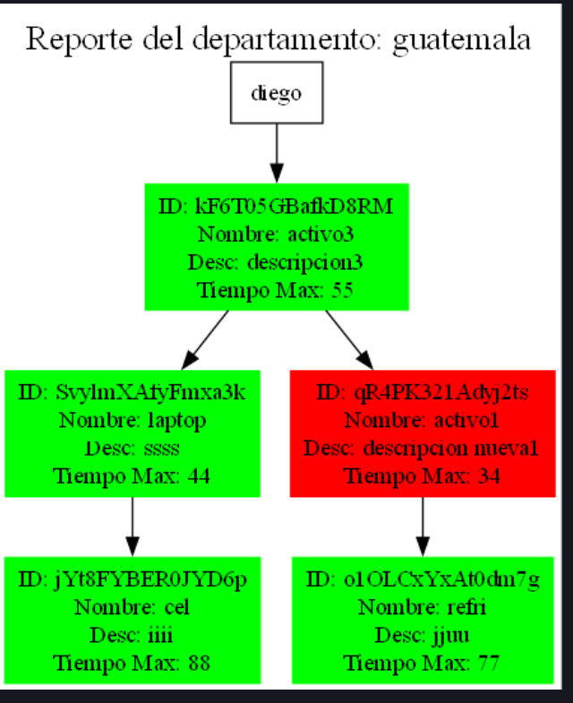

# Manual de Usuario - Sistema de Renta de Activos

## Introducción

Este manual proporciona una guía completa para utilizar el Sistema de Renta de Activos, una aplicación de consola desarrollada en C++ para la gestión de alquiler de activos entre usuarios.

## Inicio de Sesión

### Pantalla Principal
Al iniciar la aplicación, encontrará la pantalla de inicio de sesión donde debe ingresar:
- Nombre de Usuario
- Contraseña
- Departamento
- Empresa

si el usuario ingresado tiene las credenciales de 
- Nombre de Usuario: admin
- Contraseña: admin

se desplegara al menú de administrador, pero si no es el admin pues entrara en un menu completamente diferente 

### Tipos de Usuarios

1. **Usuario Administrador**: 
   - Tiene acceso total al sistema
   - Puede crear, modificar y eliminar usuarios
   - Genera diversos reportes del sistema

1. **Usuarios Regulares**:
   - Pueden agregar activos para rentar
   - Pueden rentar activos de otros usuarios
   - Pueden gestionar sus propios activos

## Funcionalidades para Usuarios Regulares

### Menú Principal de Usuario
Después de iniciar sesión, el usuario tiene las siguientes opciones:

1. **Agregar Activo**
   - Ingrese un nombre para el activo
   - Proporcione una descripción
   - El sistema generará automáticamente un ID único de 15 caracteres
   - 

2. **Eliminar Activo**
   - Se mostrará una lista de sus activos con ID y nombre
   - Seleccione el ID del activo a eliminar
   - Confirme la eliminación
   - 

3. **Modificar Activo**
   - Se mostrarán sus activos disponibles
   - Seleccione el ID del activo a modificar
   - Solo puede modificar la descripción del activo
   - 

4. **Rentar Activo**
   - Explore el catálogo de activos disponibles
   - Seleccione un activo por su ID
   - Especifique los días de alquiler
   - El activo se eliminará del catálogo una vez rentado
   - 

5. **Activos Rentados**
   - Ver lista de activos que ha rentado
   - Opción de devolver activos
   - 

6. **Mis Activos Rentados**
   - Lista de activos que tiene actualmente en alquiler
   - Opción de registrar devolución
   - 

7. **Cerrar Sesión**
   - Salir de la cuenta actual

## Funcionalidades del Administrador

### Menú de Administrador
El administrador tiene acceso a las siguientes opciones:

1. **Registrar Usuario**
   - Crear nuevos usuarios en el sistema
   - Asignar departamento y empresa

2. **Generar Reportes**
   - Reporte de Matriz Dispersa: muestra la matriz dispersa en ese momento
   - 
   - Reporte de Activos Disponibles por Departamento: pedira el departamento a filrtrar y muestra el avl de los usuarios, si esta en verde es que esta disponible pero si esta en rojo es que esta rentado
   - 
   - Reporte de Activos Disponibles por Empresa:  pedira la empresa  a filrtrar y muestra el avl de los usuarios, si esta en verde es que esta disponible pero si esta en rojo es que esta rentado
   - 
   - Reporte de Transacciones: muestra el estado de la lista circular doblemente enlazada 
   - 
   - Reporte de Activos de un Usuario:en lista todos los usuarios y pedira que usuario queremos ver su avl individual
   - 
   - Reporte de Activos Rentados por Usuario: muestra en forma de lista todos los movimientos que un usuario hizo al estar logeado 
   - 

3. **Ordenar Transacciones**
   - Ordenar transacciones por ID
   - Opciones de orden ascendente o descendente
   - 
   - ascendentemente: 
   - 
   - descendentemente:
   - 
## Consideraciones Importantes

- Cada activo tiene un ID único de 15 caracteres
- Los usuarios se identifican por departamento y empresa
- Un activo se elimina del catálogo cuando es rentado
- Los reportes se generan utilizando Graphviz

## Solución de Problemas

- Verifique que sus credenciales sean correctas
- Asegúrese de pertenecer a un departamento y empresa válidos
- Compruebe que tiene activos disponibles antes de intentar rentarlos

#
## Nota Final

Este sistema proporciona una plataforma intuitiva para la renta de activos entre usuarios, con funcionalidades completas de gestión y seguimiento.

